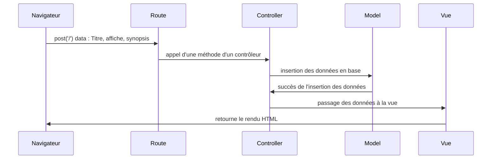
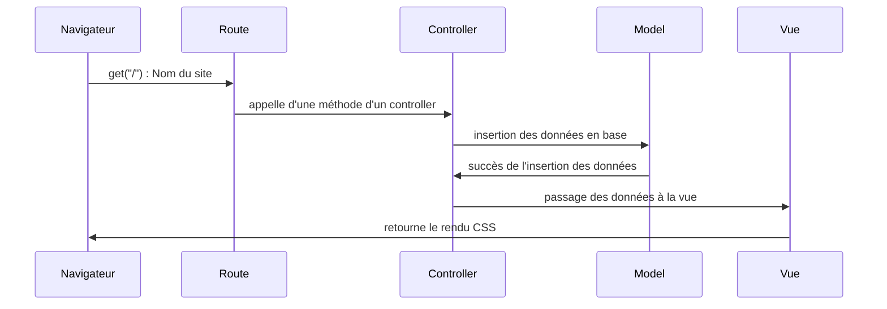
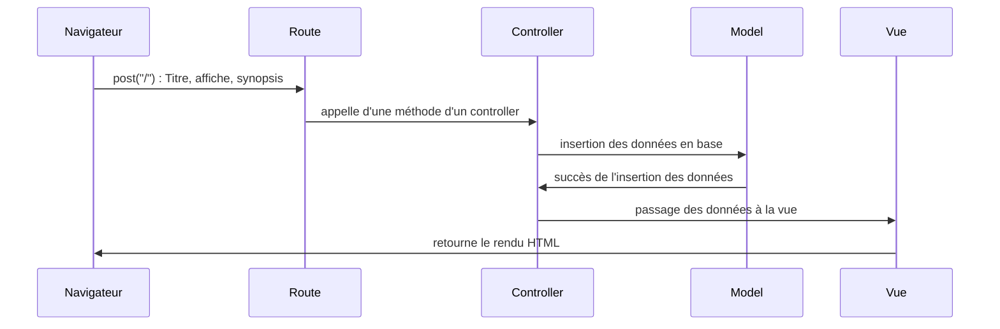
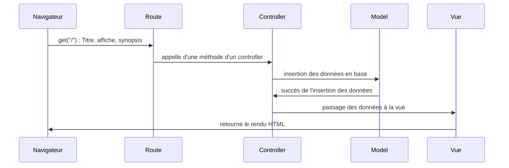
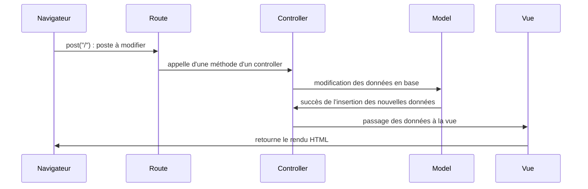
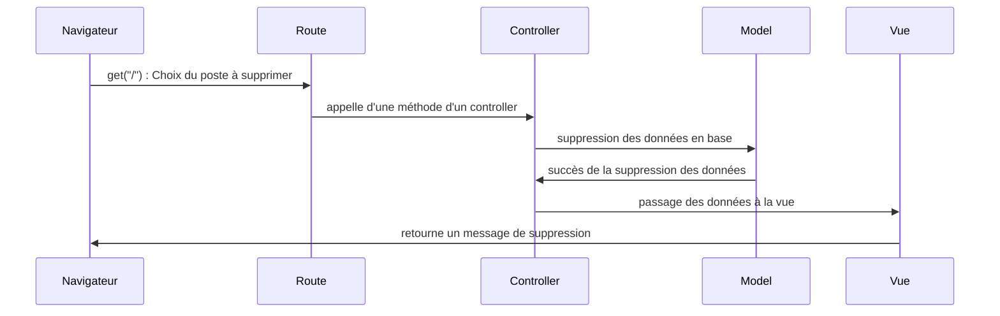

Wireframe du site : https://www.figma.com/file/LUPdLjdUROYCjkWCUlVd4f/Sprint_07?node-id=0%3A1

# Création d'un poste

# Acces page d'accueil

# Création d'un poste

# Lecture d'un poste

# Modification d'un poste

# Suppression d'un poste

