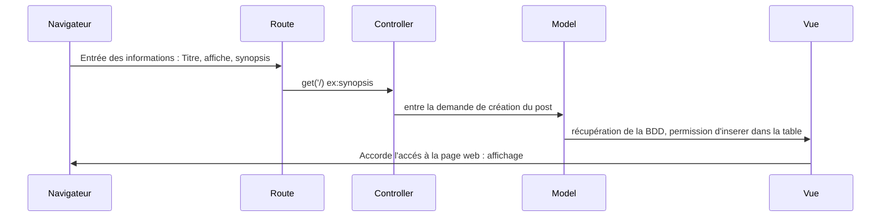

# Création d'un poste

```mermaid
sequenceDiagram
participant Navigateur
participant Route
participant Controller
participant Model
participant Vue

Navigateur->>Route: Entrée des informations : Titre, affiche, synopsis
Route->>Controller: get('/) ex:synopsis
Controller->>Model: entre la demande de création du post
Model->>Vue: récupération de la BDD, permission d'inserer dans la table
Vue->>Navigateur: Accorde l'accés à la page web : affichage


```
