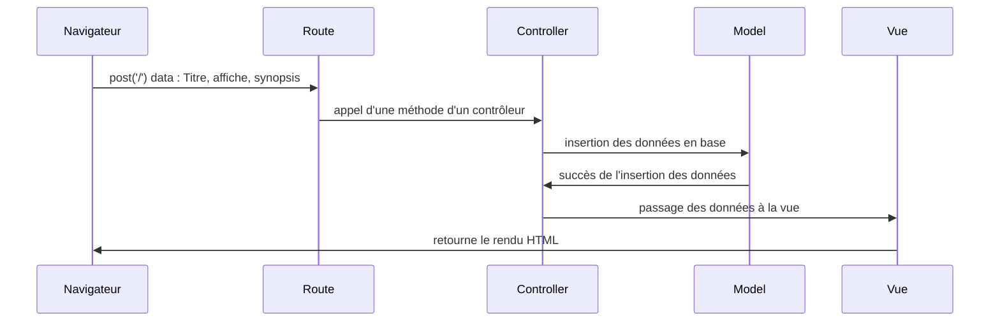

# Création d'un poste

```mermaid
sequenceDiagram
participant Navigateur
participant Route
participant Controller
participant Model
participant Vue

Navigateur->>Route: post('/') data : Titre, affiche, synopsis
Route->>Controller: appel d'une méthode d'un contrôleur
Controller->>Model: insertion des données en base
Model->>Controller: succès de l'insertion des données
Controller->>Vue: passage des données à la vue
Vue->>Navigateur: retourne le rendu HTML
```
